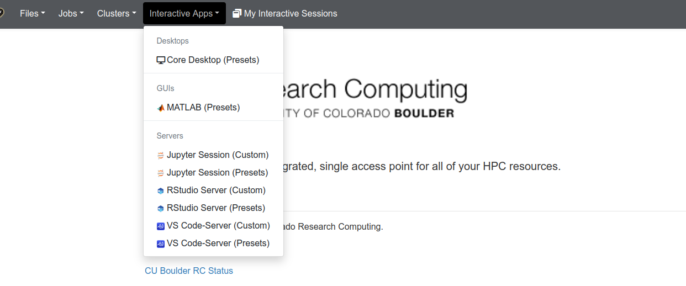
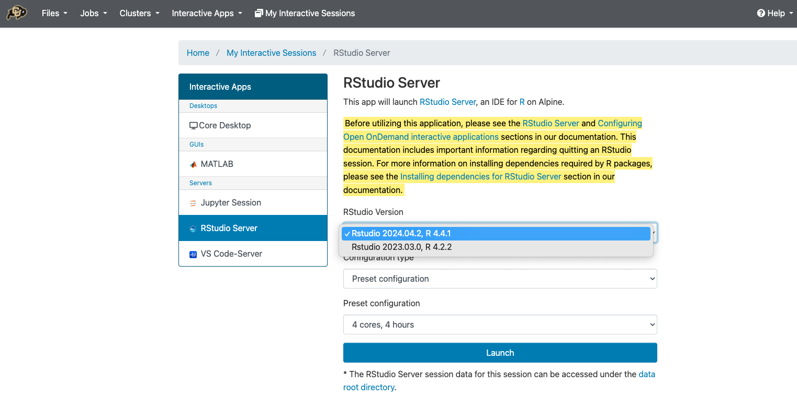
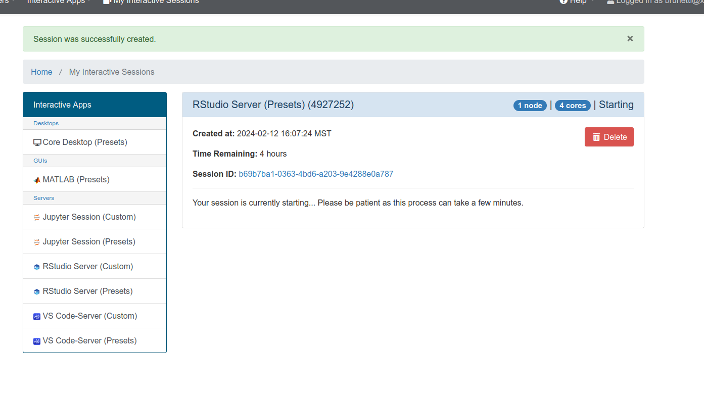
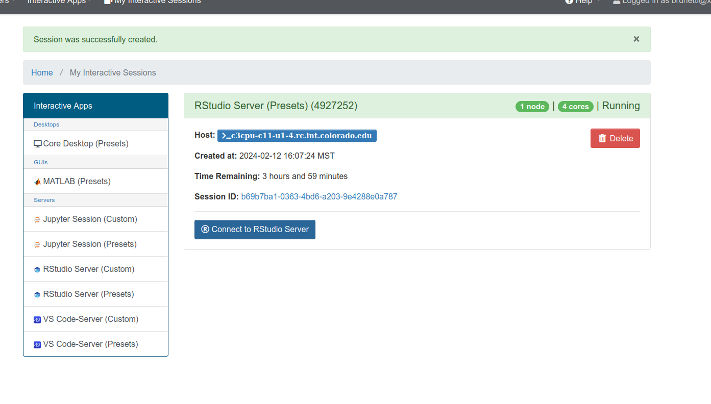
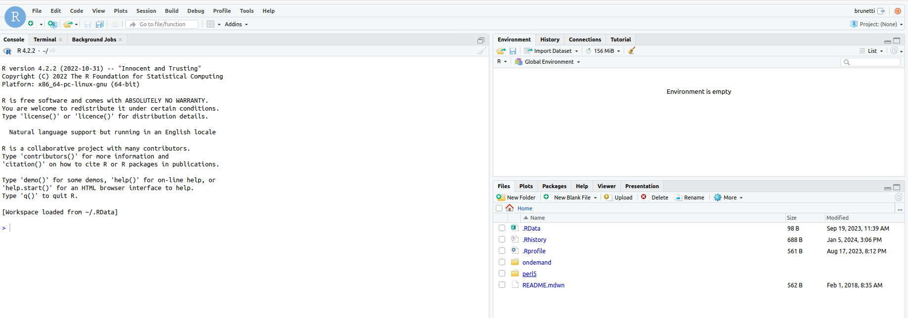
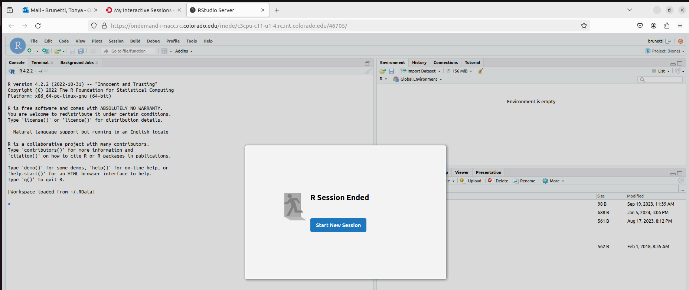
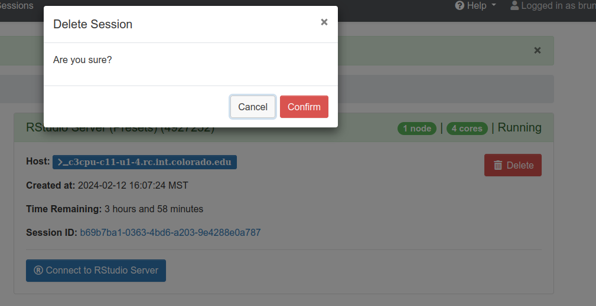
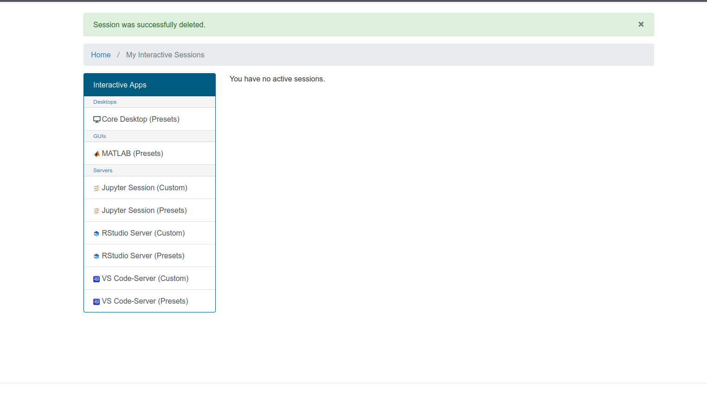

This script contains scripts related and hints for R library installation related to the utilization of Rstudio on Alpine.

## Installing Packages using Rstudio through the OnDemand Portal.  

Installing CRAN and bioconductor packages can pose some installation problems within Alpine due to the limited availability of system level OS library dependencies that are not readily globally installed.  To bypass these issues, we have provided a few script to install these dependencies through an Apptainer container.  Once this process has been completed, you should be able to login to Rstudio OnDemand and install CRAN packages and Bioconductor packages using `install.packages()` and `BiocManager::install()`, respectively.  

<br/>  

If you have **never logged into the Rstudio OnDemand portal** [please start here](#logging-into-rstudio-ondemand)  
If you have logged into the the Rstudio OnDemand portal before, [please start here](#setting-up-os-library-dependencies-only-required-one-time-for-most-users)  


### Logging into Rstudio OnDemand

1.  **If you have never logged into the Rstudio OnDemand portal**, please start a session by going to: https://ondemand-rmacc.rc.colorado.edu  and login with your Alpine credentials.  
<br/>  
2.  Upon successful login, you will want to go to the `Interactive Apps` tab located at the top of the page then select the option from the dropdown menu called: `RStudio Server (Presets)`.  
<br/>  
   
<br/>  

3.  That should take you to you the following page where you will click on the blue `Launch` botton at the bottom. Currently, the latest rstudio version is 4.4.1.  
<br/>
  
<br/>  

4.  After you press the `Launch` button, the SLURM scheduler will work on allocating your requested resources for Rstudio.  You will see a page that looks like the following.  It can take a few minuutes, so please be patient!  
<br/>  
  
<br/>  

5.  Once your Rstudio session is ready for you to use, you will the following (notice the green Running banner at the top).  Make  sure to press the `Connect to RStudio Server` button at the bottom and that will put you into Rstudio.  
<br/>  
  
<br/>  

6.  You will see once you logged in, you now have a functional Rstudio session with the resources you requested!  
<br/>  
  
<br/>  

7. Now that you have logged in, in order to exit, you can press the red button located on the top right corner of your page and once pressed and you confirm exiting, you will receive the following message:  
<br/>  
  
<br/>  

8.  Now go back to your interactive session tab browser and make sure to press the red `Delete` button to end your rstudio session request.  When asked to confirm, hit the red "Confirm" button.  
<br/>  
  
<br/>  

9.  You can confirm that you are logged out of Rstudio and have killed your RStudio session by seeing this in your active interactive sessions page:  
<br/>  
  
<br/>  

10. Now you can proceed to the next section: `Setting Up OS library dependencies (only required one-time for most users)` below!  

<br/>  


### Setting Up OS library dependencies (only required one-time for most users)  
1.  First you will want to download the following scripts into your `/projects/$USER/` directory on Alpine:  
* step0_modify_overlay.sh  
* step1_install_os_deps.sh  
<br/>  

2.  WARNING!!  This part can take a couple hours of Alpine builing your container, so if you don't want trust your internet connection or to prevent an interruptions, you may want to first run this behind a `screen` or `tmux` session.  

Once behind a `screen` or `tmux` session, run the following:  
```
acompile --ntasks=4 --time=4:00:00
```  
<br/>  

3.  Then change directories into `/projects/$USER/software` by running the following:  
```
cd /projects/$USER/software
git clone https://github.com/kf-cuanschutz/Rstudio_repo_related_files.git
cd Rstudio_repo_related_files
```  
<br/>  

4.  Now run the following if you wish to use the latest Rstudio version, 4.4.1:  
```
chmod u+x step0_modify_overlay.sh  
chmod u+x step1_install_os_deps.sh
./step0_modify_overlay.sh  
```

**Note: If you wish to use the legacy 4.2.2 version, please make sure to run the following below instead:**
```
chmod u+x step0_r_v4_2_2_modify_overlay.sh  
chmod u+x step1_install_os_deps.sh
./step0_r_v4_2_2_modify_overlay.sh 
```

<br/>  

5.  Once that completes,  run the following; note this can take a couple hours but after you do it once, often times users do not need to do it again unless there are new OS dependencies that you require:  
```
./step1_install_os_deps.sh
```
<br/>  

6.  Once the above completes, you will run the `exit` comand twice; the first once will exit you out of the container, and the second exit command will kill your acompile session.  
```
exit
exit
```
<br/>

7.  Now you are all done!  You should be able to [request an Rstudio OnDemand session by following instructions listed in this link](#logging-into-rstudio-ondemand) and then install all R packges using `install.packages()` and `BiocManager::install()`.
