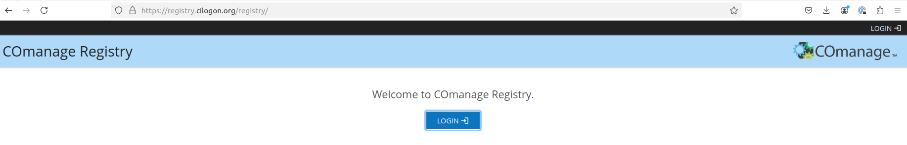
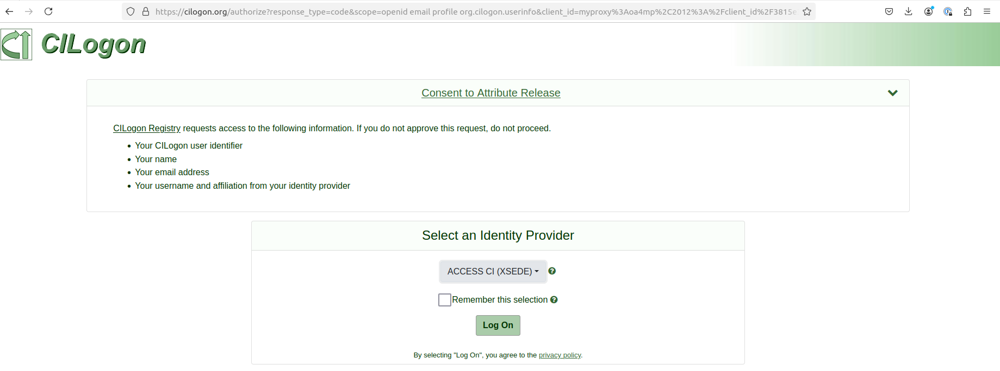
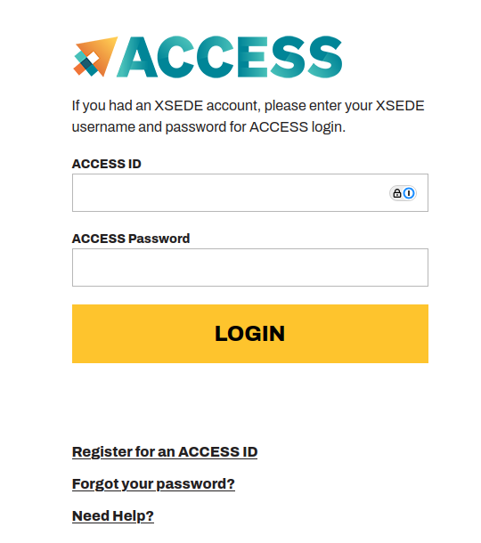
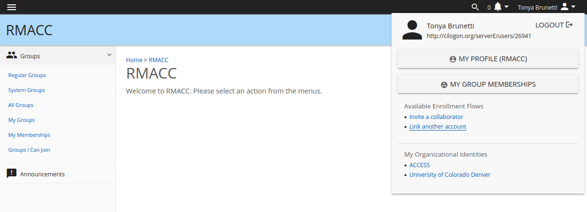
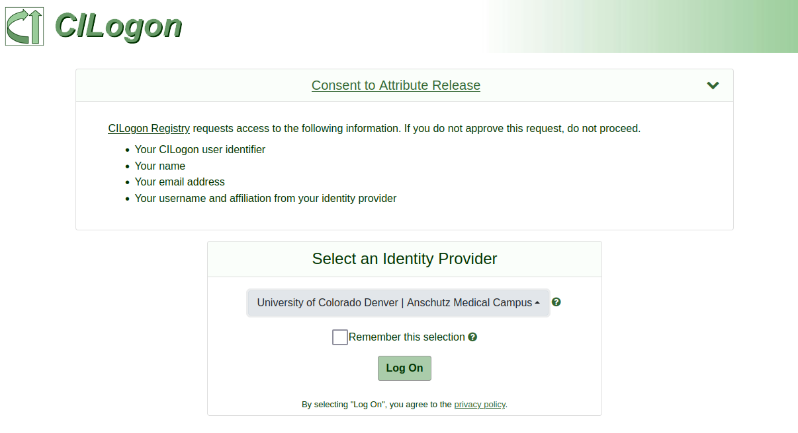

# How to link your AMC credentials to your CI Registry Logon Account for SSH key access and control  

1. Go to https://registry.cilogon.org/ which will take you the following page.  Click the blue "LOGIN" button.  

  

2. When prompted for your identity provider, select "ACCESS CI (XSEDE)"  

  

3. Input you usual ACCESS credentials and ACCESS password.  

vv

4. Accept the duo push to your phone.  

5. Once accepted it go to the top right corner of the login screen and click on your name.  Click the blue hyperlink "Link another account".   

  

6. This will take you to a similar screen as in step 2, except this time, **selec the identity provideer to link which is University of Colorado Denver | Anschutz Medical Campus**  

  

7. This will prompt you for the Anschutz Medical Campus authenticator. If prompted, input your official university provided CU Anschutz username and password  (not the new username provided for Alpine for AMC) and then accept the DUO push for Anschutz or if you are an AMC users using the Linux VPN, this will be your YubiKey credentials.  

8. Wait until the registry gives you confirmation of a success.  Now you can login with CU Anschtuz credential to the COmanage CI registry to add new ssh key or access keys if required.  

